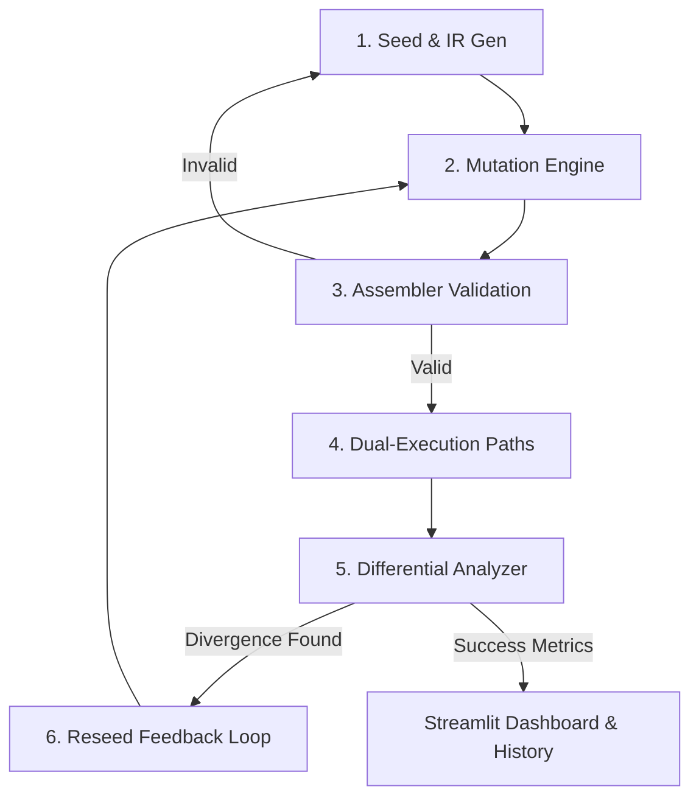

# LLVM IR Differential Testing Framework
*A Self-Improving Iterative Fuzzer & Optimization Analytics Studio*

---

## 1. Title
**Automated Compiler Validation via Iterative Differential Mutation Fuzzing and Optimization Analytics on LLVM IR**

---

## 2. Abstract
Modern optimizing compilers (such as LLVM/Clang) are among the most complex software systems in existence. Because they undergo aggressive optimizations to convert high-level source code into high-performance machine binaries, they are highly susceptible to silent miscompilations (compiler bugs that change program behavior without throwing compile-time errors). 

This project introduces an end-to-end **LLVM IR Differential Testing Framework** designed to discover behavioral and optimization divergences between different optimization tiers (specifically `lli` interpreter, Clang `-O0`, and Clang `-O3`). By generating well-formed LLVM Intermediate Representation (IR) programs, applying semantic-preserving and control-flow-altering mutations, and executing them under different compilation profiles, the system acts as an oracle to identify divergences in output, exit codes, and execution times. 

Crucially, the framework implements a **Feedback Loop Fuzzing Engine** that preserves diff-producing seeds for subsequent generations, allowing mutations to stack and explore deeper optimization paths. Additionally, it compiles optimization-reduction metrics (such as instruction elimination rates and binary size savings) to evaluate compiler optimization efficacy. A unified **Streamlit Dashboard** provides real-time visualization of cross-run trends and strategy-specific diff rates.

---

## 3. Methodology

The framework utilizes an iterative pipeline structure consisting of six key stages:



### Stage 1: Seed & IR Generation
The framework can start from scratch or bootstrap using existing seeds:
*   **Template-based Generation**: Generates well-formed LLVM IR files containing computational arithmetic and control structures.
*   **LLM-backed Generation (Optional)**: Employs OpenAI models to synthesize diverse, valid LLVM IR programs.
*   **Reseeding**: Automatically integrates feedback seeds from previous runs to compound complex mutations.

### Stage 2: The Mutation Engine (10 Core Strategies)
To trigger compiler optimizations and uncover edge-case bugs, the engine applies random combinations of 10 distinct, semantics-altering and structure-altering mutations:

1.  **Opcode Swap**: Swaps mathematically similar operations (e.g., `add` ↔ `sub`, `xor` ↔ `or`) to introduce calculation variations.
2.  **Insert Dead Code**: Injects unused math computations (e.g., `%dead = add i32 0, 5`) to test the compiler's dead-code elimination (DCE) efficiency.
3.  **Block Split**: Splits the basic block sequence with unconditional branches to test Control Flow Graph (CFG) simplification.
4.  **Conditional Branch & Phi (Trivially Taken)**: Replaces return values with a branch through a conditionally always-true path, merging inputs via a `phi` node.
5.  **Deep CFG Split**: Creates a nested, multi-level diamond branch pattern. Both branches calculate values and merge using complex phi nodes, forcing Clang's loop-unrolling and register-allocation algorithms to resolve them.
6.  **Constant Tweak**: Randomly replaces integer constants to alter branch and loop bounds.
7.  **Loop Insertion**: Wraps return values inside an active loop accumulator that computes values iteratively, testing loop-invariant code motion (LICM) and loop strength reduction.
8.  **Helper Call Inline**: Spawns an external helper function and injects call frames, verifying whether Clang `-O3` correctly performs function inlining while `-O0` keeps the call stack.
9.  **Global Variable Load**: Injects global constants loaded into memory dynamically. Tests Clang's ability to constant-fold and eliminate global loads under `-O3`.
10. **SIMD Vector Operations**: Injects `<4 x i32>` vector insertion and extraction instructions, testing vectorizers and instruction selection (ISel).

### Stage 3: Assembler Validation
Every mutated file is checked via the LLVM assembler (`llvm-as`) and the optimizer verifier (`opt -verify`). Files that fail syntactic or semantic verification are discarded, logging invalid code structures to prevent noisy crashes during compilation.

### Stage 4: Dual-Execution Path Architecture
To evaluate the correctness and optimization behavior, each valid IR file is run through three isolated environments:
1.  **Reference Interpreter (`lli`)**: Runs the IR directly without compile-time machine transformations.
2.  **Unoptimized Binary (Clang `-O0`)**: Compiles with debug properties and zero optimization.
3.  **Highly Optimized Binary (Clang `-O3`)**: Applies aggressive optimizations (dead code elimination, loop transformations, vectorization).

### Stage 5: Differential Analysis & Oracle
The outputs from the execution stage are parsed and cross-referenced. A divergence is flagged if:
*   The stdout or stderr of `-O0` and `-O3` mismatch.
*   The exit codes of the processes differ.
*   The lli interpreter output diverges from the compiled outputs.

### Stage 6: The Feedback Loop (Reseeding Fuzzer)
When a behavioral diff is captured:
1.  The offending IR is immediately copied into `feedback_seeds/`.
2.  In the next run, the pipeline scans this directory and prioritizes these files as seeds.
3.  An auto-pruner keeps only the 50 most recent unique seeds to ensure high-density seed diversity.

---

## 4. Results & Analytics

### Metrics & Historical Run Tracking
Every execution saves its analytical data into `results/history.jsonl` to track compiler behaviors over multiple fuzzing cycles.

*   **Instruction-Count Optimization Rate**:
    Calculates the exact instruction difference between the compiled unoptimized code (`-O0` instruction list) and the optimized code (`-O3`). 
    $$\text{Instruction Reduction \%} = \frac{\text{Instructions in } O0 - \text{Instructions in } O3}{\text{Instructions in } O0}$$
    *(Normally ranges between **90% - 99%** as Clang consolidates basic calculations into constants).*

*   **Binary Size Savings**:
    Tracks the size difference in compiled machine bytes to measure compiler optimization efficacy across mutation strategies.

*   **Strategy Diff Success Rate**:
    Traces which mutation strategy was active when a behavioral divergence occurred. This highlights which areas of the compiler (e.g., Vectorization, Loop Unrolling, Inlining) are most vulnerable to generating miscompilations.

---

## 5. Quick Presentation Q&A Reference (For your presentation)

*   **Q: What is the main purpose of this project?**
    *   *A: To find silent bugs in compilers. If `-O0` and `-O3` produce different outputs for the same code, the compiler has a bug. We automate finding these.*

*   **Q: How does the mutation engine make this effective?**
    *   *A: We don't just generate random text. We start with valid LLVM IR and apply structured transformations (like loops, function calls, vector instructions) that are grammatically correct but complex enough to trigger compiler optimizations.*

*   **Q: What is the "Feedback Loop"?**
    *   *A: It's what makes this a fuzzer. If a mutated file finds a difference or does something interesting, we save it and mutate it further in the next run. This allows mutations to stack up, creating highly complex nested test cases.*

*   **Q: How does the dashboard help?**
    *   *A: It visualizes which mutation strategies find the most bugs (Strategy Diff Rates) and tracks overall optimizer efficiency (instruction reduction and binary size savings) over time.*

---

## 6. Running the System

To run a cycle of the testing pipeline:
```bash
./run.sh --gen-count 10 --mut-per-file 3
```

To view the live web dashboard:
```bash
streamlit run ui_app.py
```
